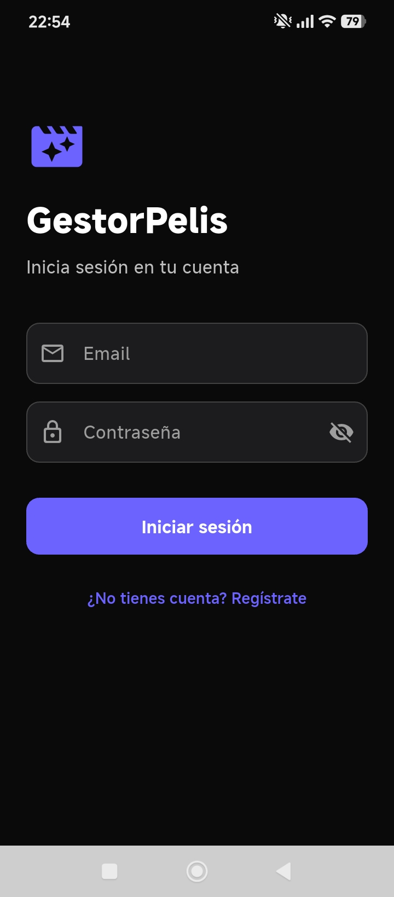
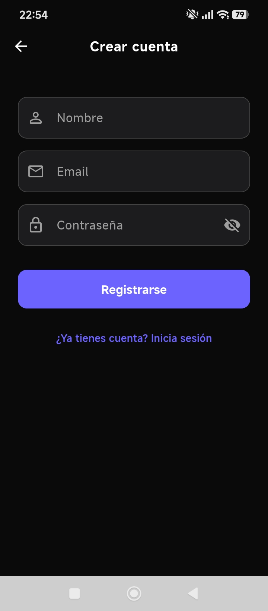
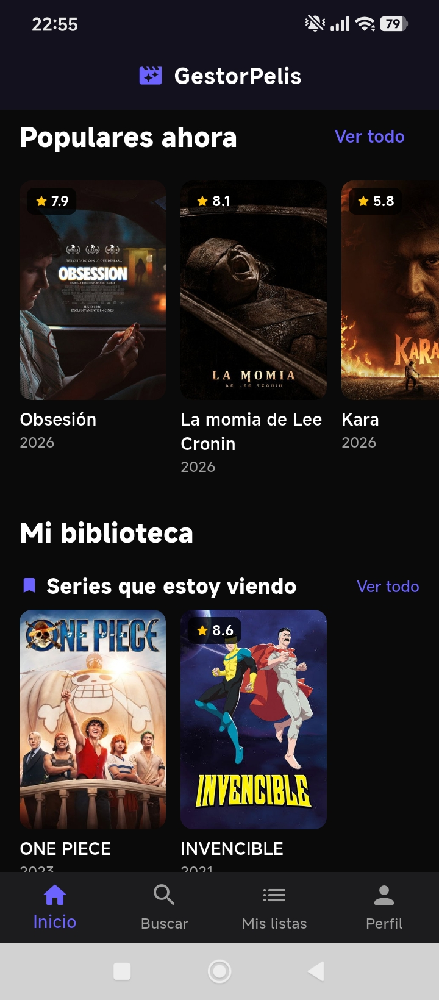
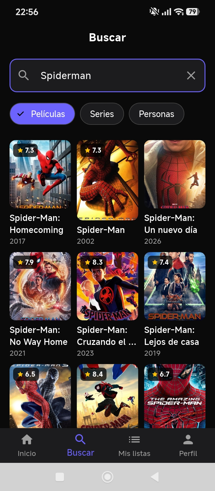
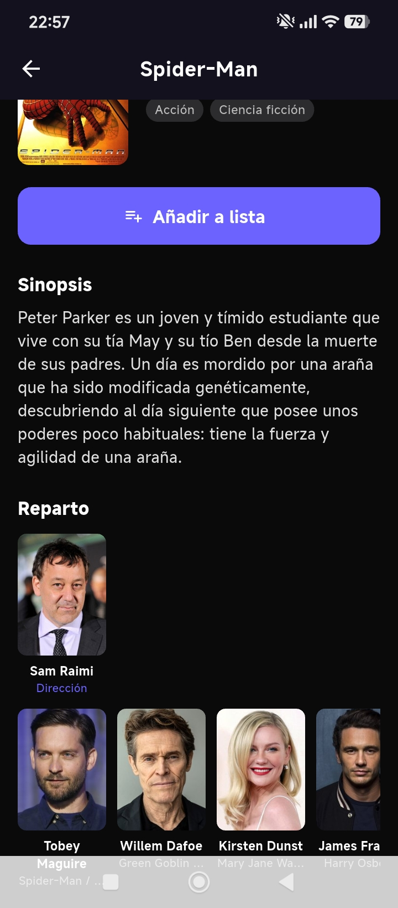
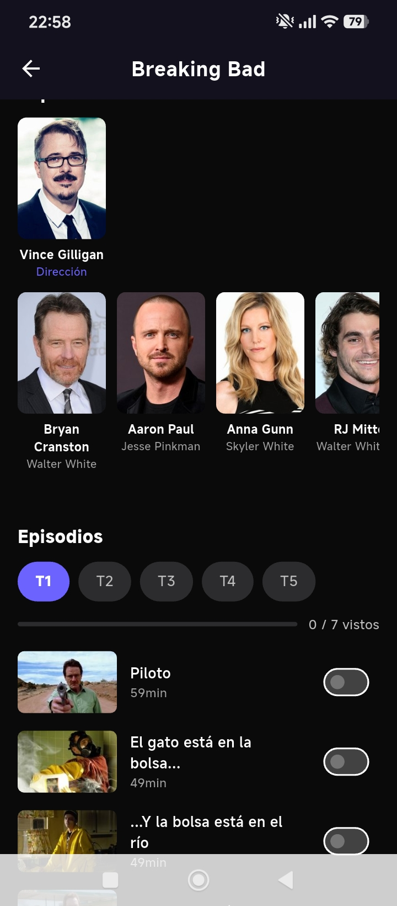
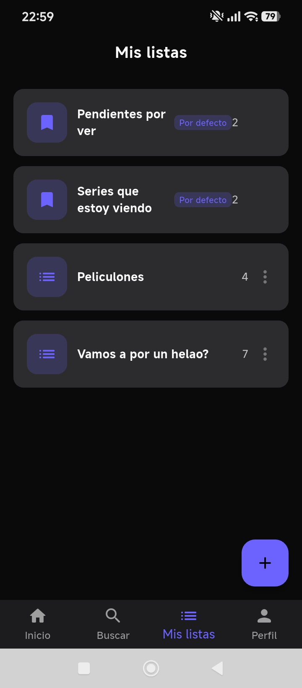
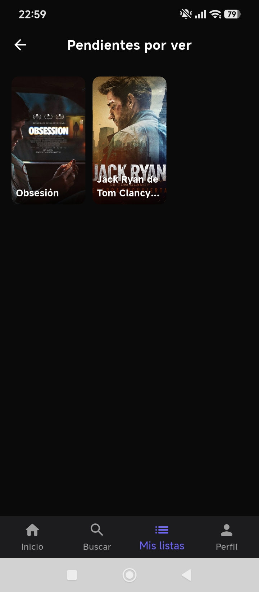
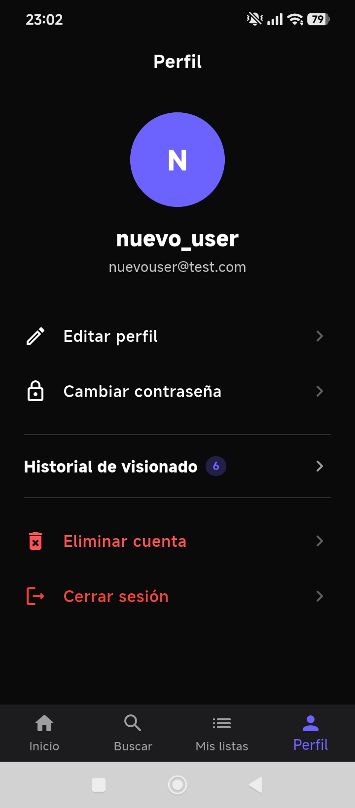
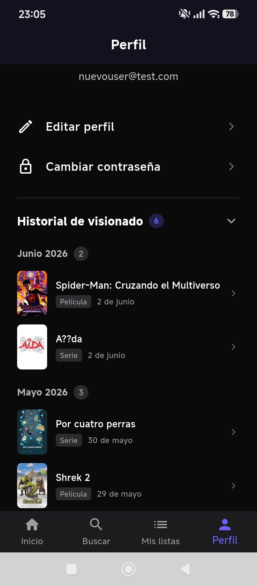

# GestorPelis — Gestor de películas y series

Aplicación móvil para gestionar tu catálogo personal de películas y series.  
Permite buscar contenido mediante la API de TMDB, organizarlo en listas personalizadas, registrar valoraciones y hacer seguimiento de episodios.

**Backend:** CodeIgniter 4 · PHP 8.2 · PostgreSQL · Docker · Railway  
**Frontend:** Flutter (Android)

---

## Descargar la aplicación

[**Descargar APK — GestorPelis v1.0**](https://github.com/josesorianoe/tfg_gestorpelis/releases/download/v1.0.0/app-release.apk)

Requisitos: dispositivo Android 8.0 o superior.

### Instalación

1. Descarga el APK desde el enlace anterior.
2. En el móvil, ve a **Ajustes → Seguridad** y activa **"Instalar aplicaciones de fuentes desconocidas"** (o "Instalar apps desconocidas" según el modelo).
3. Abre el archivo descargado y pulsa **Instalar**.
4. Una vez instalada, abre **GestorPelis** desde el cajón de aplicaciones.

---

## Tutorial de uso

### 1. Crear una cuenta

Al abrir la app por primera vez, pulsa **"Crear cuenta"**, introduce tu nombre, correo y contraseña y pulsa **Registrarse**. Si ya tienes cuenta, introduce tus datos en la pantalla de inicio de sesión.

Al registrarte se crean automáticamente dos listas por defecto: **"Pendientes por ver"** para guardar contenido que quieres ver próximamente, y **"Series que estoy viendo"** para las series en curso.

 

### 2. Pantalla principal

Tras iniciar sesión accedes a la pantalla de inicio, donde encontrarás un carrusel con el contenido más popular en ese momento y, más abajo, los ítems de tus listas.



### 3. Buscar películas y series

Usa la pestaña **Buscar** (icono de lupa) para buscar cualquier película o serie por título. Puedes filtrar los resultados por **película**, **serie** o **persona**. Pulsa sobre un resultado para ver su ficha completa.



### 4. Ver el detalle de un título

En la pantalla de detalle encontrarás la sinopsis, géneros, fecha de estreno, valoración media, reparto y el botón **"Añadir a lista"** para guardarlo en tu colección. En el caso de las series, también aparece la lista de temporadas y episodios con un toggle para marcar cada episodio como visto.

 

### 5. Gestionar tus listas

Desde la pestaña **Mis listas** puedes ver todas tus listas. Las dos listas por defecto (*Pendientes por ver* y *Series que estoy viendo*) aparecen siempre al inicio con la etiqueta "Por defecto". Puedes crear listas nuevas pulsando el botón **+**, o pulsar sobre una lista para ver su contenido, editar ítems o eliminarlos deslizando.

Al añadir un título puedes indicar si ya lo has visto, añadir una puntuación y escribir una reseña personal.

 

### 6. Tu perfil

En la pestaña **Perfil** puedes editar tu nombre, cambiar tu contraseña, consultar tu historial de visionado agrupado por mes y solicitar la eliminación de tu cuenta.

 

---

## Estructura del repositorio

```
├── app/               # Backend — CodeIgniter 4 (API REST)
├── mobile/            # Frontend — Flutter (código fuente Android)
├── screenshots/       # Capturas de pantalla de la aplicación
├── docker/            # Configuración Docker (desarrollo local)
├── Dockerfile.prod    # Imagen de producción (Railway)
└── README.md
```

---

## API en producción

`https://tfggestorpelis-production.up.railway.app`
